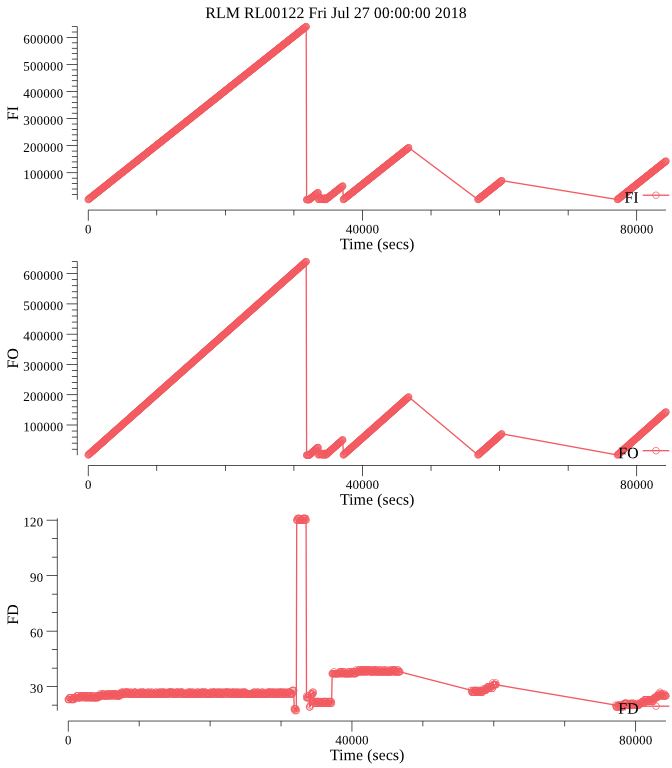

# rlmlogs

## Objective

This utility is designed to analyze logs generated by RLM.

## Usage

```
rlmlogs plot --combined --rlmid RL00122 --rtdiag FI,FO,FD --plotfile plot 20180701.zip
```
The above command analyzes the logsin the zip file provided extracting FI, FO, FD parameters and plotting the
timeseries data of the FI, FO and FD parameters in one combined png file.

### Example plot


